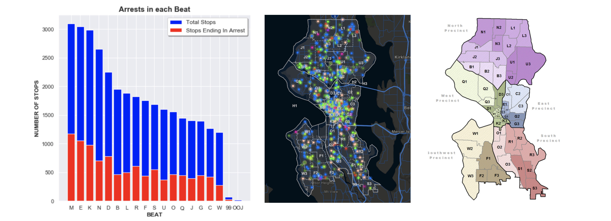

# Seattle Terry Stops

### Tools Used
Python, Scikit-learn, NumPy, Pandas, Matplotlib, Seaborn

## Introduction

In light of the tremendous focus on the Black Lives Matter movement in 2020, I was interested in studying the Seattle Police Department Terry Stops data. The data set provides records of stops, frisks and arrests since 2015, including features such as the age and race of both subjects and officers.

The goal of this project was two fold: firstly, to explore patterns and trends, with a specific focus on the relationship between race and police stops; secondly, to build a classification model that would predict with adequate precision whether a stop would result in an arrest. 

Below is a selection of the findings I found the most meaningfull. 

## Exploratory Data Analysis 

The exploratory data analysis provided insight into stark disparities of stops according to age and race.

#### Younger police officers are more likely to stop and arrest a subject compared to older officers

#### White police officers are the most likely to arrest a subject, with Native American and Blacks being the least likely

#### Beats with high crime correspond to those with the highest number of stops

 
#### Blacks and Native Americans are disproportionately over-arrested compared to their percentage in the Census, whereas Whites and Asias are under-arrested

#### The null that the proportion of Blacks arrested is equal to the percentage of Blacks in the Seattle population is rejected

## Classification Models
Since the target of stop resolution is imbalanced (24% of stops result in arrest and 76% do not) I employ several different sampling methods to improve the predictability of my random forest and logistic regression models. The techniques used are synthetic minority oversampling, balancing class weight, and undersampling. I evaluate the success of my models by primarily looking at the precision and F1 scores relative to other measures; I prefer a model with the lowest false positive rate possible (the fewest number of innocent subjects arrested).

#### Predictive Features
The features determined to play the most predictive role in the models appear to be when:
1) the officer is called to the location (via 911, text etc.)
2) the location is in a high-crime beat
3) the subject has a blade as a weapon
4) the officer or subject race is white 
5) the subject race is black 

#### The model with the highest scores was the Balanced Random Forest

#### Compared to a dummy baseline, the balanced and undersampled RFC and LR were about 10% more precise and had a 24% better F1 score

#### Balancing class weight improved RFC precision by 31%

